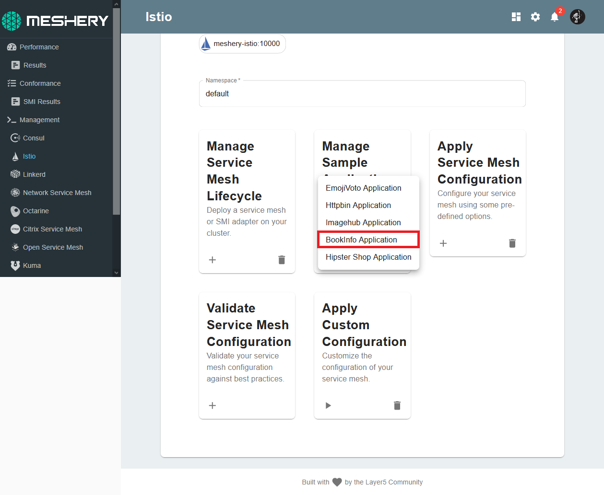
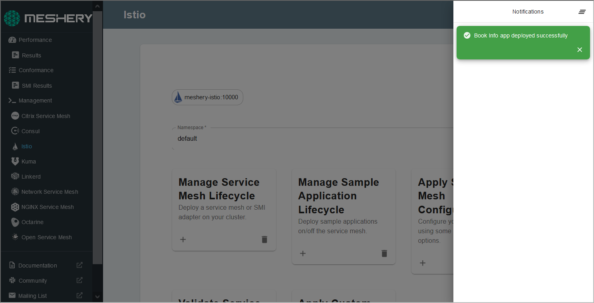

To get better acquainted with Istio and Meshery, we can now run a sample application to implement and work with the Istio's features:

The [Bookinfo](https://istio.io/latest/docs/examples/bookinfo/) application is installed with the Istio package and can be deployed with a single click using Meshery. 
The application displays information about a book, similar to a single catalog entry of an online book store. Displayed on the page is a description of the book, book details (ISBN, number of pages, and so on), and a few book reviews. 
_The Bookinfo sample application has no dependency on Istio and can be deployed on any service mesh but for the purpose of this tutorial session, we will be using Istio._

The application uses `sidecars proxy`, which can be either manually or automatically injected into the pods. Your kubernetes environment should support either, `v1`,`v1beta1` or the `v1beta2` APIs. You can confirm the API version by executing:
`kubectl api-versions | grep admissionregistration`{{execute}}

The default Istio installation uses automatic sidecar injection. Label the namespace that we are using to host the application:
`kubectl label namespace default istio-injection=enabled --overwrite`{{execute}}

Get a NamespaceSelector, which decides whether to run the webhook on an object based on whether the namespace for that object matches a defined group of objects (`selector`)
`kubectl get namespace -L istio-injection`{{execute}}

The output should look like this:

| NAME                | STATUS | AGE | ISTIO-INJECTION |
|---------------------|--------|-----|-----------------|
| default             | Active |  5m |     enabled     |  
| istio-system        | Active |  3m |     disabled    |  
| kube-node-lease     | Active |  6m |                 |  
| kube-public         | Active |  6m |                 |
| kube-system         | Active |  6m |                 | 
|kubernetes-dashboard | Active |  6m |                 |

- Navigate to the **Istio Management** page on Meshery and enter `default` in the Namespace field.
- Select the `Bookinfo application` in the `Sample Application` drop down menu.

When the application has been installed, you will receive a pop-up notification:

