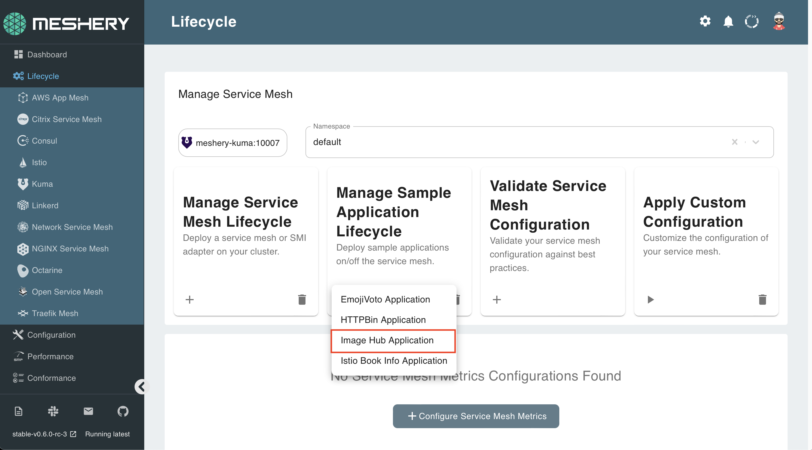

Sample Applications are deployed on top of a service mesh to help you explore and analyze your mesh's functionalities and features. They are also an excellent way to provide a consistent workload to run performance tests against.

## ImageHub

[Image Hub](https://github.com/layer5io/image-hub) is a sample application created by the Layer5 community with the purpose of exploring Web Assemblies using WASM filters. Its features have now been expanded to allow Load Testing, Traffic Management etc.

## Deploy Image Hub on Kuma

- Navigate to the **Kuma Management** page on Meshery with `default` in the Namespace field.
- Select the `Image Hub application` in the `Manage Sample Application Life` drop down menu.

You will be notified of successful deployment.

**Let's verify that your deployment works. Run**:
(The *Available* column might take upto a minute to get updated)

`kubectl get deployment -n default`{{execute}}

Sample Output:

|        NAME       | READY | UP-TO-DATE | AVAILABLE | AGE |
|:-----------------:|:-----:|:----------:|:---------:|:---:|
|       api-v1      |  1/1  |      1     |     1     | 88s |
|       web-v1      |  1/1  |      1     |     1     | 88s |

### Let's inspect our pod:

1. View the details of the deployed pods:

    `watch kubectl get po -n default`{{execute}} 

If you cannot see the *Ready* column updated, this is because the deployment can take up upto a minute. When the deployment is complete, the page will auto-refresh. You can use `CTRL+ C` to switch back to the terminal.

2. View the details of the services:

    `watch kubectl get svc -n default`{{execute}} 

3. Choose one of ImageHub's services (e.g. web-service), and view it's sidecar configuration:

    `kubectl get svc -n default`{{execute}}

    `kubectl describe svc/web -n default`{{execute}}

4. Assess the application deployment by port-forwarding the web-service service:

    `kubectl port-forward svc/web 8080 --address 0.0.0.0 -n default`{{Execute}}

The Image Hub application should now be deployed on the HTTP port: `8080`. Make your way to the `ImageHub` Server tab. For this tutorial, the server is configured to be listening at `http://localhost:8080`
